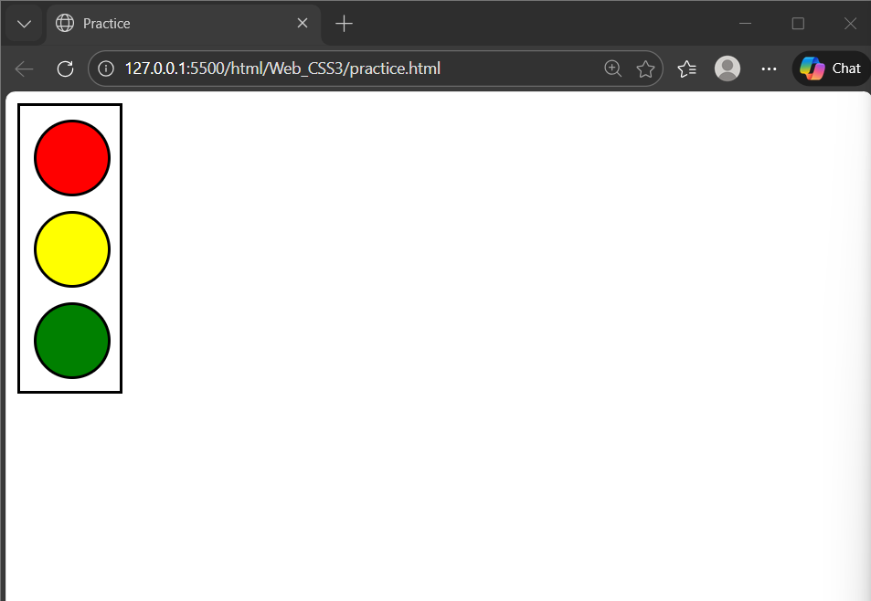

# 
## CSS Practice – Traffic Light 🚦

This is a simple CSS practice project where I created a traffic light using `div` elements and basic CSS styling.

### 📸 Output Screenshot

### 🛠️ Concepts Used
- HTML div structure
- CSS box model
- border-radius
- colors & alignment

output of my CSS

